# 👨‍💻 Full-stack Engineer

### 🎓 Education
Cambridge A-Levels @ Taylor's University

### 💼 Work Experience 
Software Engineer Intern @ Mindhive Sdn. Bhd.
* Built data migration/ingestion pipelines for unstructured enterprise data into an ERP system for 5 clients.
* Designed and implemented a scalable Units of Measurement (UOM) architecture in the Frappe framework, enabling consistent data handling and streamlined ERP workflows.
* Engineered rule-based ERP system enhancements to dynamically apply compliance instructions and pricing adjustments during purchase transactions.

### 🛠 Technical Skills
* **Languages:** Python, TypeScript, JavaScript, SQL, C++
* **Frameworks & Tools:** Frappe, ERPNext, React, Node.js, n8n, Tailwind CSS
* **Specializations:** Computer Vision, Machine Learning (PIML), Algorithmic Trading, IoT & Embedded Systems

### 🚀 Projects
* 📈 Quantitative portfolio allocation model leveraging Fama-French factors, K-means clustering, and 15 years of S&P 500 data with technical indicators (public repo).

* 🤖 'One-Prompt to Launch a Business' SaaS platform using a 7-agent AI orchestration system.
  Link: https://olvon-riyf.onrender.com/ (wait ~30 seconds for the app to load)
  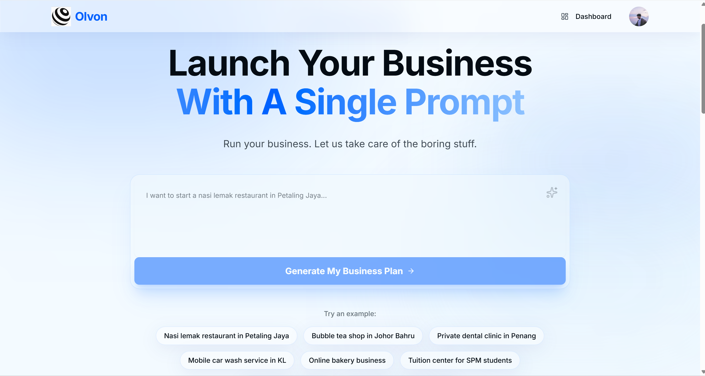 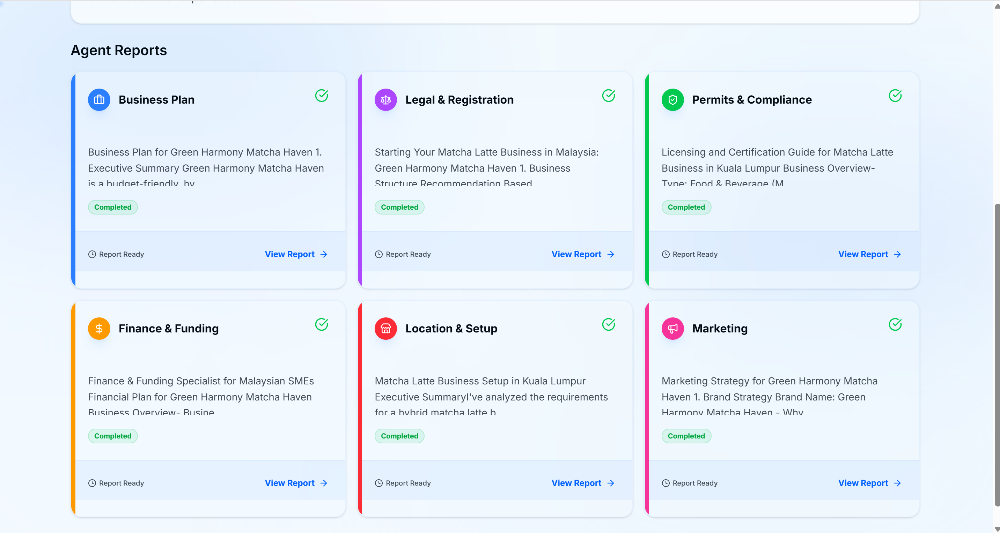 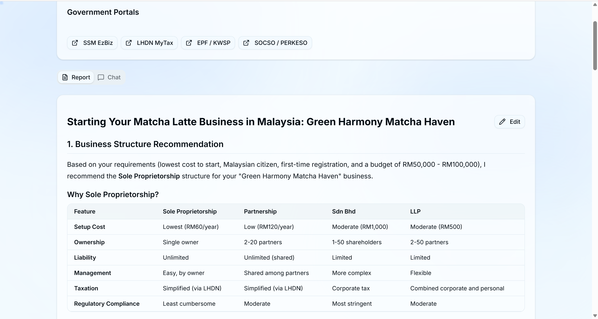 

* 👗 Virtual try‑on web application built alongside a 3D-animated company website.
  Web app link: https://olvon-webapp.vercel.app/
  Website link: https://olvon.site/
  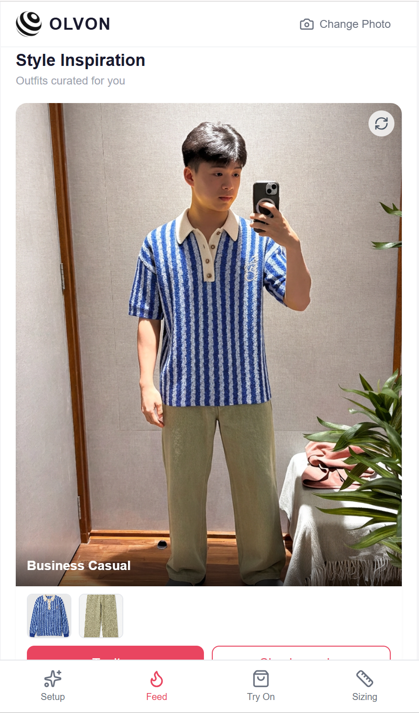 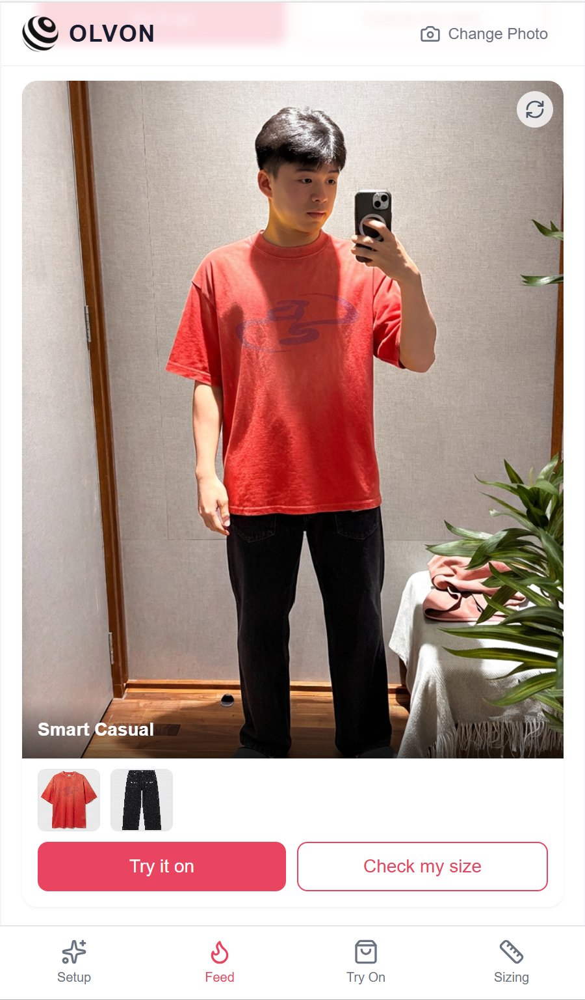 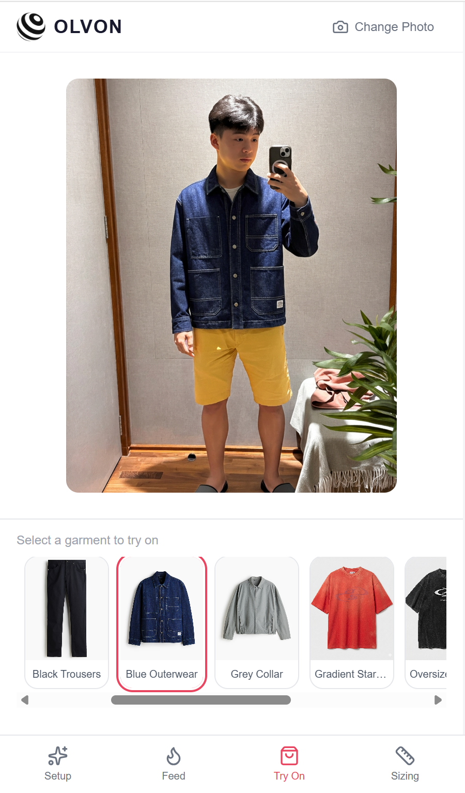

* 📱 Mobile e‑commerce app centered on virtual try‑on, featuring user onboarding flows, secure Google/email authentication, database integration, and an interactive TikTok‑style feed.
  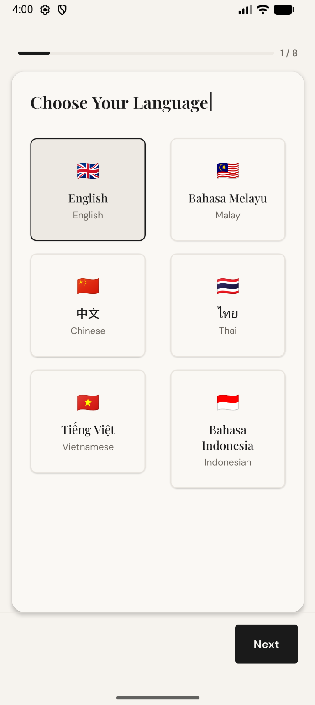 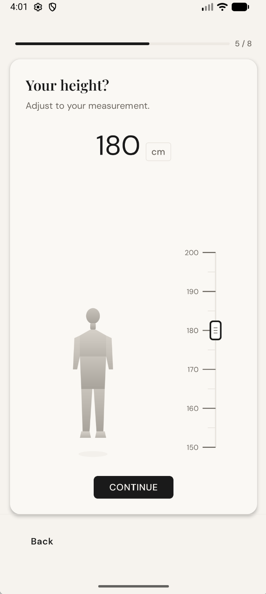 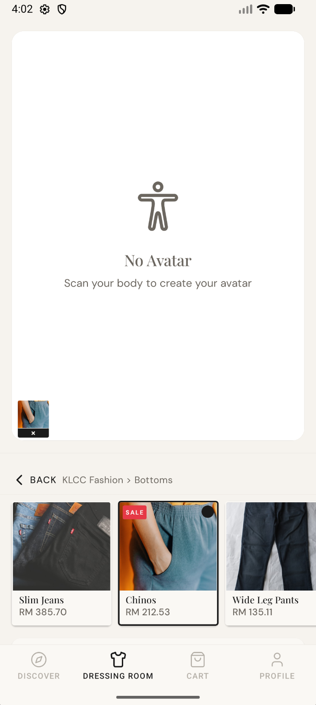 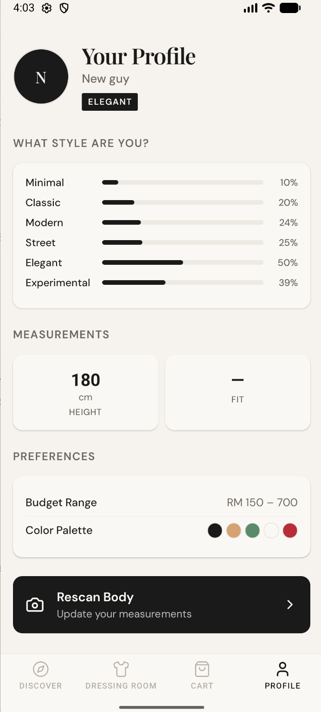 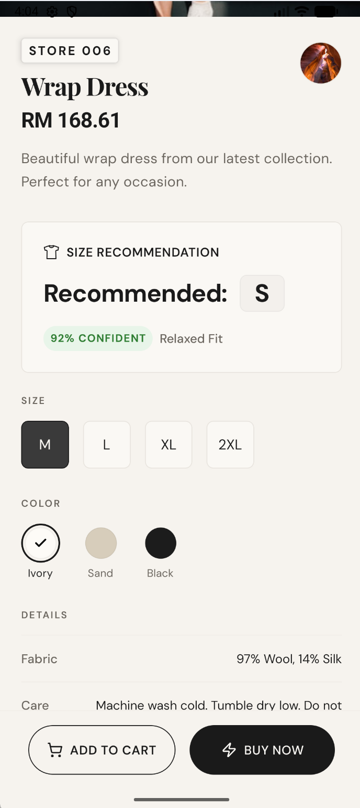 

* ❄️ Designed and built an automated water‑cooling system integrating a canister filter, Peltier module, thermoelectric controller, and 12V fan assembly for efficient heat dissipation.
     
